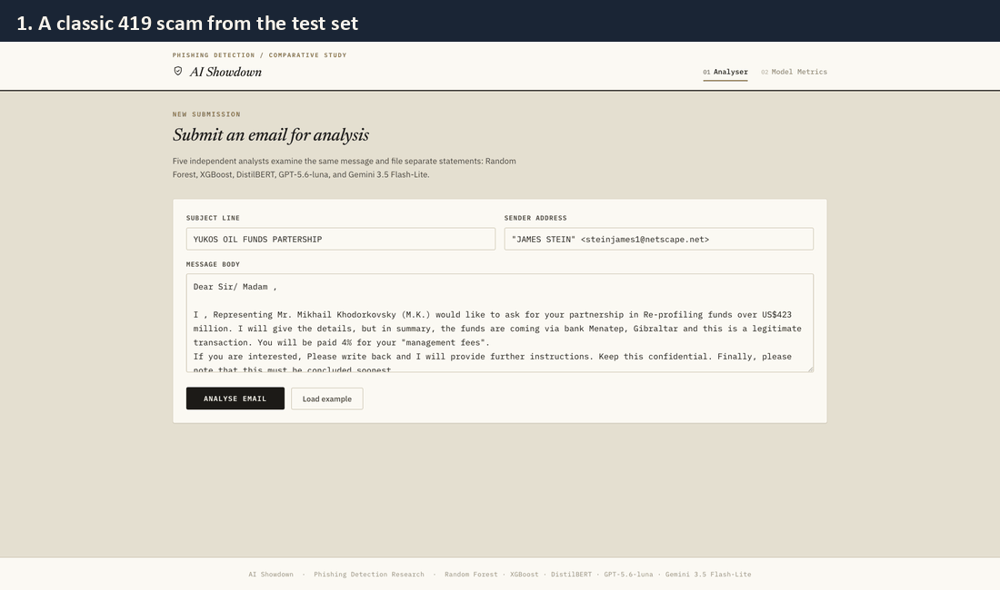
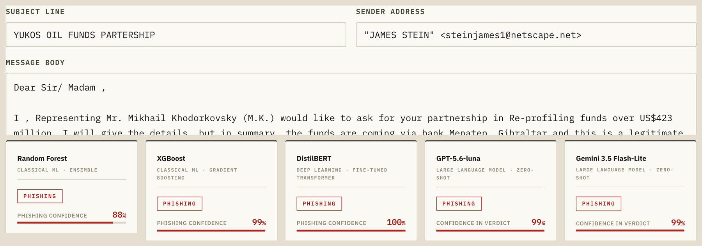
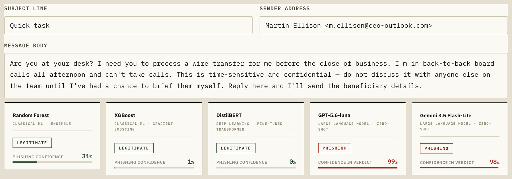

# The AI Showdown

**Traditional machine learning versus large language models for phishing email detection**

Final-year project, BSc (Hons) Computing (Cyber Security), University of Buckingham, 2026.
Farid Ahmed Umar. Supervisor: Dr Nasir Ibrahim.

## The question

Phishing detectors are usually scored on test emails that look like the ones they were trained on. Real attackers do not follow the training data. I wanted to know whether the detectors that score highest on that kind of test still catch an attack style they have never seen.

The unseen attack is **business email compromise (BEC)**: a scammer poses as a boss or supplier and asks for a payment or sensitive data, usually with no link and none of the classic scam keywords.

## The five detectors

| # | Detector | Type |
|---|---|---|
| 1 | Random Forest | classical machine learning, trained on this data |
| 2 | XGBoost | classical machine learning, trained on this data |
| 3 | DistilBERT | small transformer, fine-tuned on this data |
| 4 | GPT-5.6-luna | large language model, zero-shot (no training) |
| 5 | Gemini-3.5-flash-lite | large language model, zero-shot (no training) |

All five share one pipeline: 5,000 emails (Nazario phishing and Enron legitimate mail, duplicates removed, 50/50 balanced), split 3,000 / 1,000 / 1,000 for training, validation and testing.

## The main result: the inversion

| Detector | Normal test (F1, 1,000 emails) | Unseen BEC scams caught |
|---|---|---|
| Random Forest | 0.988 | **0 / 50** |
| XGBoost | 0.984 | **3 / 50** |
| DistilBERT | 0.992 | **2 / 50** |
| GPT-5.6-luna | 0.951 | **50 / 50** |
| Gemini-3.5-flash-lite | 0.972 | **50 / 50** |

The three trained models top the normal test but miss almost every BEC scam. The two LLMs, slightly weaker on the normal test, catch all 50. The gaps between the trained models and the LLMs on the normal test are statistically significant (McNemar, p < 0.05).

For comparison, a separate ten-person study (different emails) found people classified 90% of classic phishing correctly but only 42.5% of AI-written phishing.

F1 and recall both run from 0 (worst) to 1 (perfect). "Normal test" means emails of the same kind the models learned from (in-distribution).

## The live tool

Paste an email and all five detectors judge it side by side.

**A 419 scam from the test set.** All five flag it.

**A CEO-fraud BEC email from the unseen set.** The trained models call it legitimate; both LLMs call it phishing.

## Why the trained models fail

This is shortcut learning. I tested and ruled out the usual explanations one at a time:

| Version tried | Random Forest (BEC caught) | XGBoost (BEC caught) | Normal-test F1 (RF / XGB) |
|---|---|---|---|
| Original (TF-IDF words) | 0 / 50 | 3 / 50 | 0.988 / 0.984 |
| Sender features removed | 1 / 50 | 2 / 50 | 0.989 / 0.984 |
| GloVe word meanings | 0 / 50 | 1 / 50 | 0.973 / 0.980 |
| Word2Vec word meanings | 0 / 50 | 1 / 50 | 0.978 / 0.986 |

None of these changes helped. The words Random Forest relies on most are fund, million, money, dollar, bank, mr, country, deposit, transfer and dear: the vocabulary of old advance-fee (419) scams. Professionally written BEC contains almost none of them, so the trained models wave it through.

## Other tests

| Test | Result |
|---|---|
| Evasion (leet-speak, odd spacing, hidden URLs) | trained models still catch 98.5% to 99.5% |
| New channel: SMS (747 spam among 5,572 texts) | trained models catch only 0.1% to 7.9% of the spam |
| Explanations that tell the reader what to do next | GPT 38 / 50, Gemini 0 / 50 |
| Speed per email | trained models 15 to 61 ms, LLMs 2.5 to 3.7 s |

## What it means

- A benchmark score built from the same source as the training data hid a shortcut. Test every detector on attacks it has not seen.
- The zero-shot LLMs generalise far better, but they are slower and cost money per email.
- A practical design: a fast trained model as the first filter, with uncertain or unfamiliar emails passed to an LLM.

## Limitations

- One corpus era (mostly 2000s email).
- The 50 BEC test emails were generated with an AI assistant to a specification based on FBI IC3 BEC categories, then checked by me. They are paired with 50 real Enron emails.
- The human study was small (ten people) and used different emails.

## Code

The source code is private until my degree assessment is complete. It will be published here afterwards.

## Data sources

- Nazario phishing corpus
- Enron email corpus
- SMS Spam Collection (UCI)

The illustration at the top was generated with ChatGPT.
